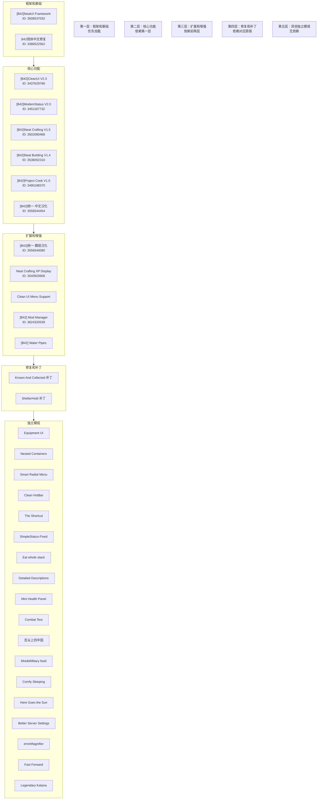
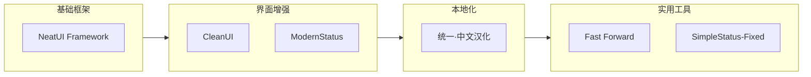

graph TD
    %% 基础框架层
    NeatUI["[B42]NeatUI Framework<br/>ID: 3508537032<br/>框架库"]
    CNBase["B42简体中文修复<br/>ID: 3386522562<br/>基础本地化"]
    
    %% 核心功能层 - 依赖NeatUI Framework
    CleanUI["[B42]CleanUI V2.3<br/>ID: 3437629766<br/>界面重设计"]
    ModernStatus["[B42]ModernStatus V2.0<br/>ID: 3451167732<br/>状态指示器"]
    NeatCraft["[B42]Neat Crafting V1.5<br/>ID: 3502080466<br/>制作界面"]
    NeatBuild["[B42]Neat Building V1.4<br/>ID: 3536052310<br/>建筑界面"]
    NeatCook["[B42]Project Cook V1.0<br/>ID: 3490188370<br/>烹饪界面"]
    
    %% 本地化层
    CNFull["[B42]统一·中文汉化<br/>ID: 3556544454<br/>全面本地化"]
    CNMod["[B42]统一·模组汉化<br/>ID: 3556540080<br/>模组本地化"]
    
    %% 扩展功能层
    XPAddon["Neat Crafting XP Display<br/>ID: 3540503606<br/>经验显示+兼容补丁"]
    CleanMenu["Clean UI Menu Support<br/>ID: 待补充<br/>控制器支持"]
    KnownCol["Known And Collected<br/>ID: 待补充<br/>收藏管理"]
    KnownPatch["Known And Collected 补丁<br/>ID: 待补充<br/>B42.13兼容"]
    Shelter["ShelterHold : Beehive<br/>ID: 3596827035<br/>蜜蜂养殖"]
    ShelterPatch["ShelterHold 补丁<br/>ID: 待补充<br/>B42.13兼容"]
    
    %% 系统功能层
    ModManager["[B42] Mod Manager<br/>ID: 3624320539<br/>模组管理工具"]
    WaterPipes["[B42] Water Pipes<br/>ID: 待补充<br/>管道系统"]
    AutoTailor["Auto Tailoring<br/>ID: 待补充<br/>自动裁缝"]
    BetterServer["Better Server Settings<br/>ID: 待补充<br/>服务器设置"]
    
    %% 界面增强层
    EquipUI["Equipment UI<br/>ID: 待补充<br/>装备界面"]
    NestCont["[B42] Nested Containers<br/>ID: 待补充<br/>嵌套容器"]
    SmartMenu["Smart Radial Menu<br/>ID: 3494108029<br/>径向菜单"]
    CleanHotBar["[B42]Clean HotBar v1.8<br/>ID: 3461263912<br/>快捷栏优化"]
    Shortcut["[b42]The Shortcut<br/>ID: 3470659758<br/>快捷工具栏"]
    SimpleStatus["[B42.13] SimpleStatus-Fixed<br/>ID: 3622457795<br/>状态指示器"]
    EatStack["Eat whole stack<br/>ID: 3617669428<br/>整堆食物交互"]
    DescTraits["[B42.13] Detailed Descriptions<br/>ID: 待补充<br/>职业特性详情"]
    HealthPanel["Mini Health Panel<br/>ID: 待补充<br/>迷你生命面板"]
    CombatText["Combat Text<br/>ID: 待补充<br/>战斗文本"]
    
    %% 农业和食物层
    ZHFood["[B42]舌尖上的中国<br/>ID: 待补充<br/>中式食物系统"]
    MREFood["More Mre&Millitary food<br/>ID: 待补充<br/>军用食物"]
    
    %% 生存环境层
    ComfySleep["Comfy Sleeping<br/>ID: 待补充<br/>睡眠系统"]
    HereSun["Here Goes the Sun<br/>ID: 待补充<br/>环境变化"]
    
    %% 时间控制和工具层
    FastForward["Fast Forward (MP)<br/>ID: 3623959321<br/>时间快进"]
    ErrorMag["errorMagnifier<br/>ID: 待补充<br/>错误报告"]
    
    %% 传说系列层
    LegKatana["Legendary Katana<br/>ID: 3418366499<br/>传说武士刀"]
    
    %% 依赖关系连接
    NeatUI --> CleanUI
    NeatUI --> ModernStatus
    NeatUI --> NeatCraft
    NeatUI --> NeatBuild
    NeatUI --> NeatCook
    
    CNFull --> CNMod
    CleanUI --> CleanMenu
    
    NeatCraft --> XPAddon
    NeatBuild --> XPAddon
    
    KnownCol --> KnownPatch
    Shelter --> ShelterPatch
    
    %% 样式定义
    classDef framework fill:#e1f5fe,stroke:#01579b,stroke-width:2px
    classDef core fill:#f3e5f5,stroke:#4a148c,stroke-width:2px
    classDef localization fill:#e8f5e9,stroke:#1b5e20,stroke-width:2px
    classDef extension fill:#fff3e0,stroke:#e65100,stroke-width:2px
    classDef system fill:#fce4ec,stroke:#880e4f,stroke-width:2px
    classDef ui fill:#e0f2f1,stroke:#004d40,stroke-width:2px
    classDef farming fill:#e1f5fe,stroke:#01579b,stroke-width:2px
    classDef survival fill:#f1f8e9,stroke:#33691e,stroke-width:2px
    classDef tools fill:#f9fbe7,stroke:#827717,stroke-width:2px
    classDef legendary fill:#fce4ec,stroke:#ad1457,stroke-width:2px
    
    class NeatUI,CNBase framework
    class CleanUI,ModernStatus,NeatCraft,NeatBuild,NeatCook core
    class CNFull,CNMod localization
    class XPAddon,CleanMenu,KnownCol,KnownPatch,Shelter,ShelterPatch extension
    class ModManager,WaterPipes,AutoTailor,BetterServer system
    class EquipUI,NestCont,SmartMenu,CleanHotBar,Shortcut,SimpleStatus,EatStack,DescTraits,HealthPanel,CombatText ui
    class ZHFood,MREFood farming
    class ComfySleep,HereSun survival
    class FastForward,ErrorMag tools
    class LegKatana legendary
```

## 🎯 加载顺序分层图



## 🔍 依赖关系分析

### 关键依赖点

1. **NeatUI Framework** (3508537032)
   - 作为整个UI增强体系的基础
   - 被6个核心模组直接依赖
   - 必须最先加载

2. **中文本地化链**
   - B42简体中文修复 (基础)
   - [B42]统一·中文汉化 (依赖基础)
   - [B42]统一·模组汉化 (依赖统一汉化)

3. **Neat系列模组链**
   - NeatUI Framework (基础)
   - Neat Crafting + Neat Building (核心功能)
   - XP Display Addon (扩展功能，兼作B42.13补丁)

### 依赖深度分析

| 依赖深度 | 模组数量 | 说明 |
|---------|---------|------|
| 0层 (无依赖) | 3 | NeatUI Framework, B42简体中文修复, 多数独立模组 |
| 1层依赖 | 6 | CleanUI, ModernStatus, Neat Crafting等 |
| 2层依赖 | 3 | 统一·模组汉化, XP Display Addon等 |
| 补丁依赖 | 3 | Known And Collected补丁, ShelterHold补丁等 |

### 兼容性风险点

1. **高风险区域**
   - 整个NeatUI生态系统在B42.13中需要额外补丁
   - 中文本地化在多人游戏中可能存在兼容性问题

2. **安全区域**
   - 独立功能模组（如Fast Forward, Legendary Katana）
   - 系统工具模组（如Mod Manager, Water Pipes）

## 📋 使用建议

### 新手玩家模组组合



### 高级玩家完整配置

按照5层加载顺序安装所有模组，特别注意：
1. 严格按照依赖顺序加载
2. 使用Mod Manager检测冲突
3. 在多人游戏环境中先进行小规模测试

### 多人游戏优化配置

优先选择多人游戏兼容的模组：
1. 跳过UI重设计类模组（可能不兼容多人）
2. 使用服务器端验证的模组列表
3. 优先加载系统功能类模组和工具类模组

---
**[← 返回项目主页](./README.md)** | **[查看详细依赖信息](./mod-dependencies.md)**